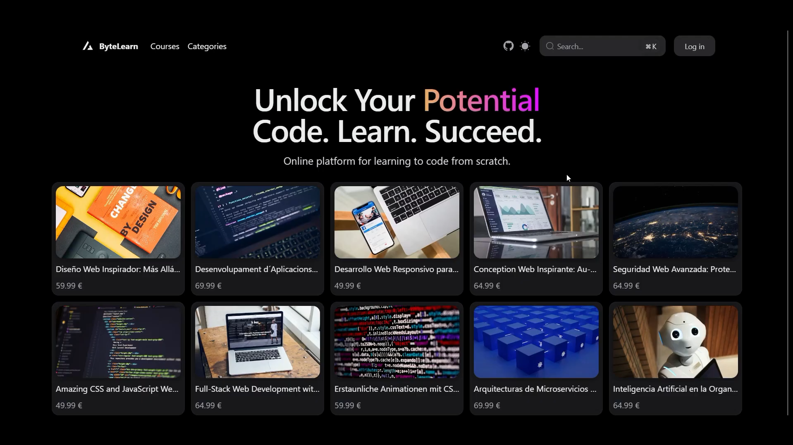
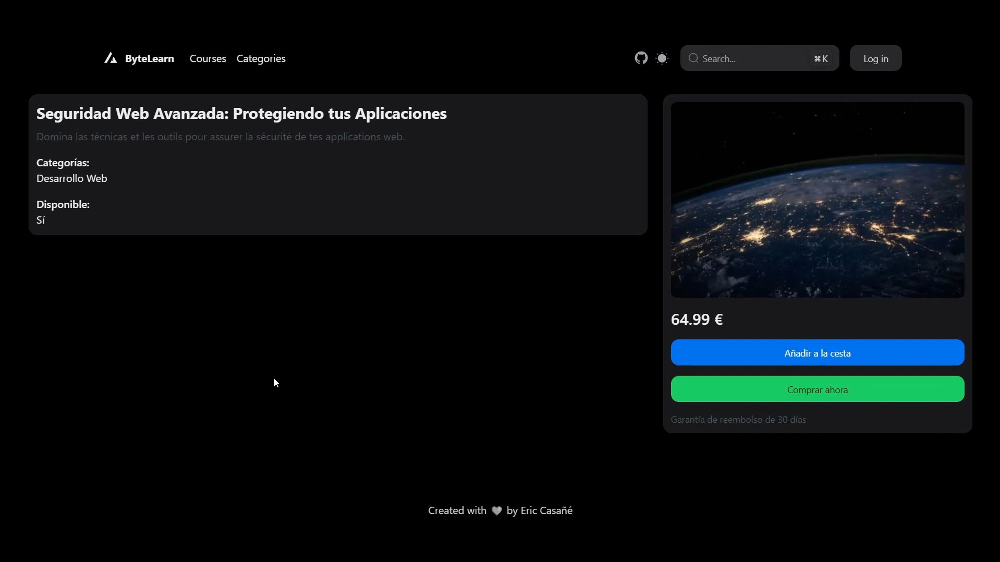
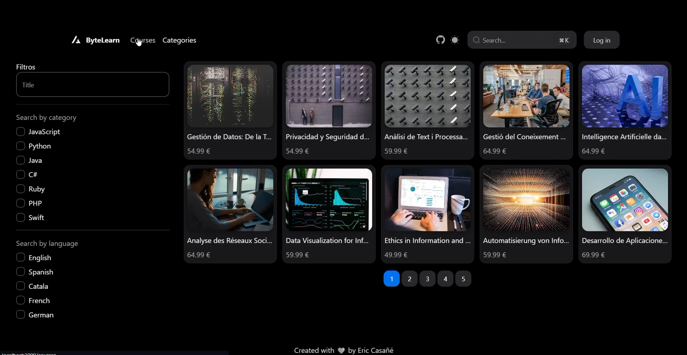

# ByteLearn Frontend

This is the frontend repository for the ByteLearn course platform. The frontend is developed with React and Next.js 14, using NextUI for the design library, which utilizes TailwindCSS.

ByteLearn is a platform where users can access a list of courses, view course details, and search for courses.

It connects to the ByteLearn backend, which is developed with Spring Boot.

**Backend Repository: [ByteLearn Backend](https://github.com/ericcasane/ByteLearn-Spring-Backend)**

**Frontend Link: [ByteLearn Frontend](https://bytelearn-platform.vercel.app/)**
(It actually doesn't work correctly because the backend is not deployed in a server.)

**Project Video: [ByteLearn Video](https://youtu.be/vFWb5POg2_k)**

## Features

- User Authentication
- List of Courses
- Course Details
- Search Courses
- Dark and Light Mode
- Other features

## Images of the frontend

### Home Page


### Course Details


### Search Courses


## Cloning the Repository

To clone this repository, open your terminal and run the following command:

```bash
git clone https://github.com/your-username/bytelearn-frontend.git
cd bytelearn-frontend
```

Installation
Install the project dependencies. You can use npm or yarn:

```bash
npm install
# or
yarn install
```

## Running the Project

To run the project, use the following command:

```bash 
npm run dev
# or
yarn dev
```

This will start the development server on http://localhost:3000.


# Next.js & NextUI Template

This is a template for creating applications using Next.js 13 (pages directory) and NextUI (v2).

## Technologies Used

- [Next.js 13](https://nextjs.org/docs/getting-started)
- [NextUI](https://nextui.org)
- [Tailwind CSS](https://tailwindcss.com)
- [Tailwind Variants](https://tailwind-variants.org)
- [TypeScript](https://www.typescriptlang.org)
- [Framer Motion](https://www.framer.com/motion)
- [next-themes](https://github.com/pacocoursey/next-themes)

## How to Use

To create a new project based on this template using `create-next-app`, run the following command:

```bash
npx create-next-app -e https://github.com/nextui-org/next-pages-template
```
## License

Licensed under the [MIT license](https://github.com/nextui-org/next-pages-template/blob/main/LICENSE).